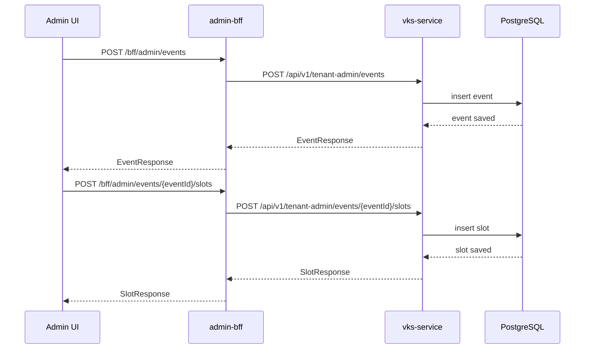
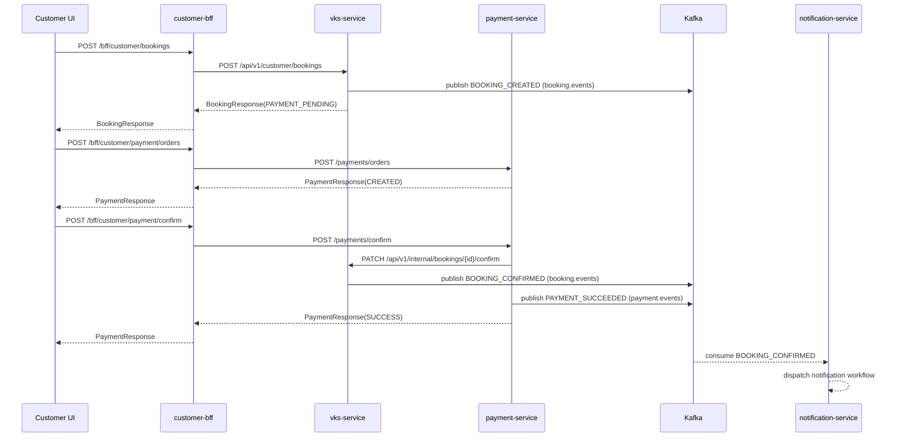
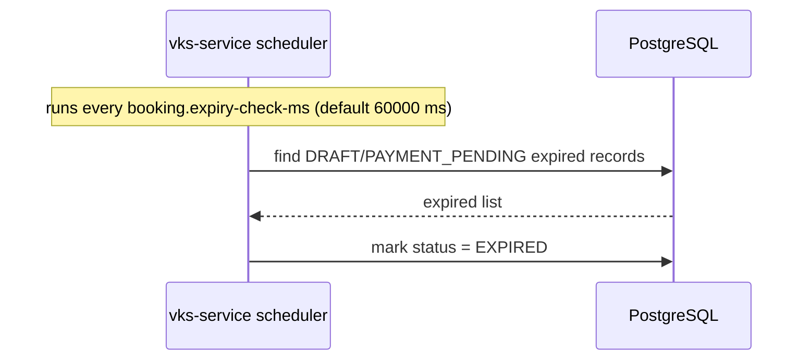

# VKS Platform Backend API Documentation

This document describes all backend services as one connected system.
It covers:
1. service-to-service connectivity
2. endpoint catalog by service
3. request and response contracts
4. synchronous business flows
5. Kafka event flow and retry behavior
6. operational and security notes

---

## 1. Backend Topology

### 1.1 Service Registry

| Service | Port | Context Path | Primary Responsibility |
|---|---:|---|---|
| vks-cloud-config-server | 8080 | / | centralized config for all services |
| admin-bff | 8088 | / | tenant-admin API facade and response shaping |
| customer-bff | 8089 | / | customer API facade and response shaping |
| vks-service | 8099 | /vks-service | identity + profile + event catalog + slot + booking core domain |
| payment-service | 8086 | /payment-service | payment order, payment confirm, webhook reconcile |
| notification-service | 8087 | /notification-service | Kafka booking-event consumer (notification dispatch) |

### 1.2 Config Server Connectivity

All services are Spring Cloud Config clients with:
- optional config import
- config-server URI default: http://localhost:8080

Config server reads native files from:
- CONFIG_REPO_PATH (default points to vks-config-repo/configuration)

---

## 2. Security and Cross-Cutting Behavior

### 2.1 JWT and Roles

JWT claims used across services:
- sub (user id)
- role (TENANT_ADMIN or CUSTOMER)
- tenant_id

Role enforcement:
- admin-bff: /bff/admin/** requires TENANT_ADMIN
- customer-bff: /bff/customer/** requires CUSTOMER or TENANT_ADMIN
- vks-service:
  - /api/v1/tenant-admin/** requires TENANT_ADMIN
  - /api/v1/customer/** requires CUSTOMER
  - /api/v1/internal/** is permitAll (internal call from payment-service)
- payment-service:
  - /payments/webhook permitAll
  - remaining /payments/** authenticated

### 2.2 Correlation ID

BFF clients attach X-Correlation-ID for downstream calls:
- admin-bff -> vks-service
- customer-bff -> vks-service
- customer-bff -> payment-service

vks-service log pattern includes CorrelationId from MDC fields when present.

### 2.3 Tenant Isolation

Tenant-aware data access is implemented in domain services and repositories by filtering with tenantId.

### 2.4 Idempotency

Idempotency key required for:
- booking create (vks-service)
- payment order create (payment-service)

Duplicate idempotency key returns conflict behavior.

---

## 3. Connectivity Matrix

| Caller | Endpoint | Callee | Callee Endpoint |
|---|---|---|---|
| Admin UI/Gateway | /bff/admin/** | admin-bff | proxy/orchestration |
| admin-bff | event and slot APIs | vks-service | /api/v1/tenant-admin/** |
| Customer UI/Gateway | /bff/customer/** | customer-bff | proxy/orchestration |
| customer-bff | profile/event/slot/booking APIs | vks-service | /api/v1/customer/** |
| customer-bff | payment APIs | payment-service | /payments/** |
| payment-service | internal booking confirm | vks-service | /api/v1/internal/bookings/{bookingId}/confirm |
| vks-service | BookingEvent publish | Kafka | booking.events |
| notification-service | BookingEvent consume | Kafka | booking.events (+ retry + dlt suffix topics) |
| payment-service | PaymentEvent publish | Kafka | payment.events |

---

## 4. API Catalog - admin-bff

Base URL:
- http://localhost:8088

Base path:
- /bff/admin

Downstream service:
- vks-service (default http://localhost:8099/vks-service)

### 4.1 GET /bff/admin/dashboard

Purpose:
- dashboard feed (currently proxies tenant-admin event list)

Downstream:
- GET /api/v1/tenant-admin/events (vks-service)

Request headers:
- Authorization: Bearer <token>

Response:
- passthrough JSON from vks-service events list

### 4.2 GET /bff/admin/events

Downstream:
- GET /api/v1/tenant-admin/events

Request headers:
- Authorization

Response 200:
```json
[
  {
    "eventId": "f4b0ea7b-9a3f-41db-aa8d-8be6769f140b",
    "eventName": "Tech Summit",
    "description": "Annual conference",
    "location": "Bengaluru",
    "startDate": "2026-09-01T10:00:00",
    "endDate": "2026-09-01T18:00:00",
    "createdBy": "9876543210",
    "createdAt": "2026-08-01T10:30:00",
    "updatedAt": "2026-08-01T10:30:00"
  }
]
```

### 4.3 POST /bff/admin/events/search

Downstream:
- POST /api/v1/tenant-admin/events/search

Request body:
```json
{
  "eventName": "Tech",
  "location": "Bengaluru",
  "createdBy": "9876543210",
  "startDateFrom": "2026-09-01T00:00:00",
  "startDateTo": "2026-09-30T23:59:59"
}
```

Response 200:
- list of EventResponse objects

### 4.4 GET /bff/admin/events/{eventId}

Downstream:
- GET /api/v1/tenant-admin/events/{eventId}

Response 200:
- EventResponse object

### 4.5 POST /bff/admin/events

Downstream:
- POST /api/v1/tenant-admin/events

Request body:
```json
{
  "eventName": "Tech Summit",
  "description": "Annual conference",
  "location": "Bengaluru",
  "startDate": "2026-09-01T10:00:00",
  "endDate": "2026-09-01T18:00:00"
}
```

Response 201:
- EventResponse

### 4.6 PATCH /bff/admin/events/{eventId}

Downstream:
- PATCH /api/v1/tenant-admin/events/{eventId}

Request body:
- same schema as create event

Response 200:
- EventResponse

### 4.7 DELETE /bff/admin/events/{eventId}

Downstream:
- DELETE /api/v1/tenant-admin/events/{eventId}

Response 204:
- no content

### 4.8 GET /bff/admin/events/{eventId}/slots

Downstream:
- GET /api/v1/tenant-admin/events/{eventId}/slots

Response 200:
```json
[
  {
    "slotId": "a6d6fca7-c5ab-41b6-ba58-62fc89e503d5",
    "eventId": "f4b0ea7b-9a3f-41db-aa8d-8be6769f140b",
    "slotDate": "2026-09-01",
    "startTime": "10:00:00",
    "endTime": "11:00:00",
    "price": 499.00,
    "capacity": 100,
    "createdAt": "2026-08-01T10:40:00",
    "updatedAt": "2026-08-01T10:40:00"
  }
]
```

### 4.9 POST /bff/admin/events/{eventId}/slots

Downstream:
- POST /api/v1/tenant-admin/events/{eventId}/slots

Request body:
```json
{
  "slotDate": "2026-09-01",
  "startTime": "10:00:00",
  "endTime": "11:00:00",
  "price": 499.00,
  "capacity": 100
}
```

Response 201:
- SlotResponse

### 4.10 PATCH /bff/admin/events/{eventId}/slots/{slotId}

Downstream:
- PATCH /api/v1/tenant-admin/events/{eventId}/slots/{slotId}

Request body:
- same schema as create slot

Response 200:
- SlotResponse

### 4.11 DELETE /bff/admin/events/{eventId}/slots/{slotId}

Downstream:
- DELETE /api/v1/tenant-admin/events/{eventId}/slots/{slotId}

Response 204:
- no content

---

## 5. API Catalog - customer-bff

Base URL:
- http://localhost:8089

Base path:
- /bff/customer

Downstream services:
- vks-service
- payment-service

### 5.1 GET /bff/customer/profile

Downstream:
- GET /api/v1/customer/profile (vks-service)

Response 200:
```json
{
  "userId": "42",
  "firstName": "John",
  "lastName": "Doe",
  "email": "john@example.com",
  "mobileNo": "9876543210",
  "tenantId": "tenant-123",
  "role": "CUSTOMER"
}
```

### 5.2 GET /bff/customer/events

Downstream:
- GET /api/v1/customer/events (vks-service)

Response 200:
- list<EventResponse>

### 5.3 GET /bff/customer/events/{eventId}

Downstream:
- GET /api/v1/customer/events/{eventId} (vks-service)

Response 200:
- EventResponse

### 5.4 GET /bff/customer/events/{eventId}/slots

Downstream:
- GET /api/v1/customer/events/{eventId}/slots (vks-service)

Response 200:
- list<SlotResponse>

### 5.5 POST /bff/customer/bookings

Downstream:
- POST /api/v1/customer/bookings (vks-service)

Request body:
```json
{
  "eventId": "f4b0ea7b-9a3f-41db-aa8d-8be6769f140b",
  "slotId": "a6d6fca7-c5ab-41b6-ba58-62fc89e503d5",
  "quantity": 2,
  "idempotencyKey": "booking-req-20260815-001"
}
```

Response 201:
```json
{
  "bookingId": "b2db5b07-58fb-4171-9b21-cd2a7fc3f74c",
  "eventId": "f4b0ea7b-9a3f-41db-aa8d-8be6769f140b",
  "slotId": "a6d6fca7-c5ab-41b6-ba58-62fc89e503d5",
  "bookedBy": "9876543210",
  "quantity": 2,
  "slotDate": "2026-09-01",
  "startTime": "10:00:00",
  "endTime": "11:00:00",
  "priceAtBooking": 499.00,
  "status": "PAYMENT_PENDING",
  "expiresAt": "2026-08-15T14:45:00",
  "createdAt": "2026-08-15T14:30:00",
  "updatedAt": "2026-08-15T14:30:00"
}
```

### 5.6 GET /bff/customer/bookings

Downstream:
- GET /api/v1/customer/bookings (vks-service)

Response 200:
- list<BookingResponse>

### 5.7 GET /bff/customer/bookings/{bookingId}

Downstream:
- GET /api/v1/customer/bookings/{bookingId} (vks-service)

Response 200:
- BookingResponse

### 5.8 PATCH /bff/customer/bookings/{bookingId}/cancel

Downstream:
- PATCH /api/v1/customer/bookings/{bookingId}/cancel (vks-service)

Response 200:
- BookingResponse with status CANCELLED

### 5.9 GET /bff/customer/confirmation/{bookingId}

Downstream:
- GET /api/v1/customer/bookings/{bookingId} (vks-service)

Response 200:
- BookingResponse (used as booking confirmation page payload)

### 5.10 POST /bff/customer/payment/orders

Downstream:
- POST /payments/orders (payment-service)

Request body:
```json
{
  "bookingId": "b2db5b07-58fb-4171-9b21-cd2a7fc3f74c",
  "amount": 998.00,
  "idempotencyKey": "payment-req-20260815-001"
}
```

Response 201:
```json
{
  "id": "8a4c7f5f-1a70-44a8-81de-2c97fbf1fc47",
  "tenantId": "tenant-123",
  "bookingId": "b2db5b07-58fb-4171-9b21-cd2a7fc3f74c",
  "paymentOrderId": "order_A1B2C3D4E5F6G7H8",
  "gatewayPaymentId": null,
  "status": "CREATED",
  "amount": 998.00,
  "createdAt": "2026-08-15T14:31:00",
  "updatedAt": "2026-08-15T14:31:00"
}
```

### 5.11 POST /bff/customer/payment/confirm

Downstream:
- POST /payments/confirm (payment-service)

Request body:
```json
{
  "paymentOrderId": "order_A1B2C3D4E5F6G7H8",
  "gatewayPaymentId": "pay_Q1W2E3R4T5",
  "signature": "signed_payload"
}
```

Response 200:
- PaymentResponse with status SUCCESS

### 5.12 GET /bff/customer/payment/{paymentOrderId}

Downstream:
- GET /payments/{paymentOrderId} (payment-service)

Response 200:
- PaymentResponse

---

## 6. API Catalog - vks-service (Core Domain)

Base URL:
- http://localhost:8099/vks-service

### 6.1 Auth APIs

#### POST /api/v1/auth/signup

Request:
```json
{
  "firstname": "John",
  "lastname": "Doe",
  "mobileno": "9876543210",
  "emailid": "john@example.com",
  "tenantId": "tenant-123",
  "password": "Pass@1234",
  "confirmPassword": "Pass@1234"
}
```

Response 200:
```json
{ "success": true, "message": "User registered successfully" }
```

#### POST /api/v1/auth/tenant-admin/signup

Request:
```json
{
  "firstname": "Admin",
  "lastname": "User",
  "mobileno": "9999999999",
  "emailid": "admin@example.com",
  "tenantId": "tenant-123",
  "password": "Pass@1234",
  "confirmPassword": "Pass@1234",
  "onboardingSecret": "admin-bootstrap-secret"
}
```

Response 200:
```json
{ "success": true, "message": "Tenant admin registered successfully" }
```

#### POST /api/v1/auth/login

Request:
```json
{
  "username": "9876543210",
  "password": "Pass@1234"
}
```

Response 200:
```json
{
  "success": true,
  "message": "Login successful",
  "token": "<access-token>",
  "refreshToken": "<refresh-token>",
  "tenantId": "tenant-123",
  "role": "CUSTOMER",
  "scopes": ["events:read", "slots:read", "bookings:read", "bookings:write"]
}
```

#### POST /api/v1/auth/refresh

Request:
```json
{ "refreshToken": "<refresh-token>" }
```

Response 200:
- LoginResponse

#### POST /api/v1/auth/forgot-password

Request:
```json
{ "username": "9876543210" }
```

Response 200:
```json
{ "success": true, "message": "OTP sent successfully" }
```

#### POST /api/v1/auth/verify-otp

Request:
```json
{ "username": "9876543210", "otp": "482910" }
```

Response 200:
```json
{ "success": true, "message": "OTP verified", "resetToken": "<reset-token>" }
```

#### POST /api/v1/auth/reset-password-with-token

Request:
```json
{
  "resetToken": "<reset-token>",
  "newPassword": "NewPass@5678",
  "confirmPassword": "NewPass@5678"
}
```

Response 200:
```json
{ "success": true, "message": "Password reset successful" }
```

#### POST /api/v1/auth/reset-password

Request (authenticated):
```json
{
  "newPassword": "NewPass@5678",
  "confirmPassword": "NewPass@5678"
}
```

Response 200:
```json
{ "success": true, "message": "Password reset successful" }
```

### 6.2 Customer Profile API

#### GET /api/v1/customer/profile

Response 200:
- CustomerProfileResponse

### 6.3 Customer Event and Slot APIs

#### GET /api/v1/customer/events

Response 200:
- list<EventResponse>

#### GET /api/v1/customer/events/{eventId}

Response 200:
- EventResponse

#### GET /api/v1/customer/events/{eventId}/slots

Response 200:
- list<SlotResponse>

### 6.4 Tenant Admin Event APIs

#### POST /api/v1/tenant-admin/events/search

Request:
- EventSearchRequest

Response 200:
- list<EventResponse>

#### POST /api/v1/tenant-admin/events

Request:
- EventRequest

Response 201:
- EventResponse

#### PATCH /api/v1/tenant-admin/events/{eventId}

Request:
- EventRequest

Response 200:
- EventResponse

#### DELETE /api/v1/tenant-admin/events/{eventId}

Response 204

### 6.5 Tenant Admin Slot APIs

#### GET /api/v1/tenant-admin/events/{eventId}/slots

Response 200:
- list<SlotResponse>

#### POST /api/v1/tenant-admin/events/{eventId}/slots

Request:
- SlotRequest

Response 201:
- SlotResponse

#### PATCH /api/v1/tenant-admin/events/{eventId}/slots/{slotId}

Request:
- SlotRequest

Response 200:
- SlotResponse

#### DELETE /api/v1/tenant-admin/events/{eventId}/slots/{slotId}

Response 204

### 6.6 Customer Booking APIs

#### POST /api/v1/customer/bookings

Request:
- BookingRequest

Response 201:
- BookingResponse

Business behavior:
1. validates event and slot within tenant
2. checks idempotency key uniqueness for tenant + user
3. enforces active-booking constraints and slot capacity
4. creates booking in PAYMENT_PENDING with expiry
5. emits BOOKING_CREATED event to Kafka

#### GET /api/v1/customer/bookings

Response 200:
- list<BookingResponse>

#### GET /api/v1/customer/bookings/{bookingId}

Response 200:
- BookingResponse

#### PATCH /api/v1/customer/bookings/{bookingId}/cancel

Response 200:
- BookingResponse with status CANCELLED

Business behavior:
- emits BOOKING_CANCELLED event

### 6.7 Internal API

#### PATCH /api/v1/internal/bookings/{bookingId}/confirm

Called by:
- payment-service after successful payment confirmation/webhook

Response 200:
- BookingResponse with status CONFIRMED

Business behavior:
- transitions PAYMENT_PENDING -> CONFIRMED
- clears expiresAt
- emits BOOKING_CONFIRMED event

---

## 7. API Catalog - payment-service

Base URL:
- http://localhost:8086/payment-service

Base path:
- /payments

### 7.1 POST /payments/orders

Auth:
- required

Request:
- PaymentOrderRequest

Response 201:
- PaymentResponse with status CREATED

Behavior:
1. validates idempotency key within tenant
2. creates payment order id
3. persists payment row
4. does not confirm booking yet

### 7.2 POST /payments/confirm

Auth:
- required

Request:
- PaymentConfirmRequest

Response 200:
- PaymentResponse with status SUCCESS

Behavior:
1. loads payment by paymentOrderId
2. idempotent return when already SUCCESS
3. validates signature (non-empty check in current implementation)
4. sets gatewayPaymentId + status SUCCESS
5. calls vks-service internal confirm endpoint
6. publishes PAYMENT_SUCCEEDED to payment.events

### 7.3 POST /payments/webhook

Auth:
- permitAll

Request:
- PaymentConfirmRequest

Response 200:
- PaymentResponse

Behavior:
1. same transition as confirm API
2. calls internal booking confirm without auth header
3. publishes PAYMENT_SUCCEEDED event

### 7.4 GET /payments/{paymentOrderId}

Auth:
- required

Response 200:
- PaymentResponse (tenant-validated)

---

## 8. API Catalog - notification-service

Base URL:
- http://localhost:8087/notification-service

REST endpoints:
- GET /internal/ping
- actuator endpoints via management config

Primary behavior:
- consumes booking events from Kafka
- applies retry and DLQ strategy
- dispatches notification logic by booking status

Consumer logic by status:
- PAYMENT_PENDING -> booking pending notification action
- CONFIRMED -> booking confirmed notification action
- CANCELLED -> booking cancelled notification action

---

## 9. 

## 10. Request and Response Models (Canonical)

### 10.1 EventRequest
```json
{
  "eventName": "Tech Summit",
  "description": "Annual conference",
  "location": "Bengaluru",
  "startDate": "2026-09-01T10:00:00",
  "endDate": "2026-09-01T18:00:00"
}
```

### 10.2 SlotRequest
```json
{
  "slotDate": "2026-09-01",
  "startTime": "10:00:00",
  "endTime": "11:00:00",
  "price": 499.00,
  "capacity": 100
}
```

### 10.3 BookingRequest
```json
{
  "eventId": "f4b0ea7b-9a3f-41db-aa8d-8be6769f140b",
  "slotId": "a6d6fca7-c5ab-41b6-ba58-62fc89e503d5",
  "quantity": 2,
  "idempotencyKey": "booking-req-20260815-001"
}
```

### 10.4 PaymentOrderRequest
```json
{
  "bookingId": "b2db5b07-58fb-4171-9b21-cd2a7fc3f74c",
  "amount": 998.00,
  "idempotencyKey": "payment-req-20260815-001"
}
```

### 10.5 PaymentConfirmRequest
```json
{
  "paymentOrderId": "order_A1B2C3D4E5F6G7H8",
  "gatewayPaymentId": "pay_Q1W2E3R4T5",
  "signature": "signed_payload"
}
```

---

## 11. End-to-End Flow

### 11.1 Admin Event/Slot Management Flow



### 11.2 Customer Booking and Payment Flow



### 11.3 Booking Expiry Flow (Scheduled)



---

## 12. Kafka Event Flow Details

### 12.1 Topics

- booking.events
  - producer: vks-service BookingEventPublisher
  - consumer: notification-service NotificationConsumer
- payment.events
  - producer: payment-service PaymentEventPublisher
  - current consumer: none in this repo

### 12.2 booking.events Message Schema

```json
{
  "eventType": "BOOKING_CREATED|BOOKING_CONFIRMED|BOOKING_CANCELLED",
  "eventId": "uuid",
  "occurredAt": "2026-08-15T09:15:30.123Z",
  "tenantId": "tenant-123",
  "bookingId": "uuid",
  "customerId": "9876543210",
  "slotId": "uuid",
  "quantity": 2,
  "amount": 998.00,
  "status": "PAYMENT_PENDING|CONFIRMED|CANCELLED|EXPIRED"
}
```

Kafka key:
- bookingId as string

### 12.3 payment.events Message Schema

```json
{
  "eventType": "PAYMENT_SUCCEEDED",
  "eventId": "uuid",
  "occurredAt": "2026-08-15T09:16:30.123Z",
  "tenantId": "tenant-123",
  "bookingId": "uuid",
  "paymentOrderId": "order_A1B2C3D4E5F6G7H8",
  "gatewayPaymentId": "pay_Q1W2E3R4T5",
  "amount": 998.00,
  "status": "SUCCESS"
}
```

Kafka key:
- paymentOrderId

### 12.4 Retry and DLQ (notification-service)

Configured with @RetryableTopic:
- attempts: 3
- backoff: delay 2000 ms, multiplier 2
- topic suffixing strategy: index-based suffix
- DLT suffix: .dlq

Practical behavior:
1. consume from booking.events
2. on failure retry via retry topics
3. final failure goes to booking.events.dlq (suffix pattern managed by Spring Kafka)

---

## 13. Error Contract and Validation Behavior

Common validation failures:
- missing required fields -> 400
- invalid path/body constraints -> 400

Conflict examples:
- duplicate booking idempotency key
- slot capacity exceeded
- duplicate payment idempotency key
- invalid payment signature

Not found examples:
- booking/event/slot/payment not found within tenant scope

Global exception handlers exist in:
- vks-service
- payment-service
- notification-service
- admin-bff
- customer-bff

---

## 14. Ops and Observability Notes

- Actuator endpoints enabled per service profile via config repo.
- Prometheus endpoint exposed on services configured with management exposure include.
- vks-service includes health, info, metrics, prometheus, and loggers endpoint exposure.
- All core services are config-server clients with retries.

---

## 15. Important Integration Notes

1. admin-bff forwards GET /bff/admin/events and GET /bff/admin/events/{eventId} to tenant-admin event read endpoints in vks-service.
2. Ensure tenant-admin read endpoints are available in vks-service runtime contract before production rollout.
3. payment-service booking confirmation call is best-effort; payment remains SUCCESS even if internal confirm call fails, and error is logged.
4. notification-service currently logs notification actions; external provider dispatch can be layered onto EmailService/adapter logic.

---

## 16. Quick Smoke Checklist

1. Start infrastructure: PostgreSQL + Kafka + Zookeeper.
2. Start config-server.
3. Start vks-service, payment-service, notification-service, admin-bff, customer-bff.
4. Signup/login, create event and slot, create booking, create payment order, confirm payment.
5. Verify booking status transitions and Kafka events.
6. Check notification-service logs for booking event consumption and retry behavior.
